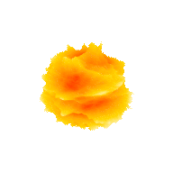

# Molten Core #

A WebGL demo powered by [three.js](https://threejs.org/) and the magic of shaders.

    

## Usage ##

* Install dependencies with `npm install; npm install --only=dev`
* Run with `npm start`

## License ##

* Gold Noise ©2015 dcerisano [at] standard3d.com, see [gold_noise.fs](src/shader/lib/gold_noise.fs)
* Molten Core Copyright (c) 2019 Tamás Gálffy, see [LICENSE](LICENSE)